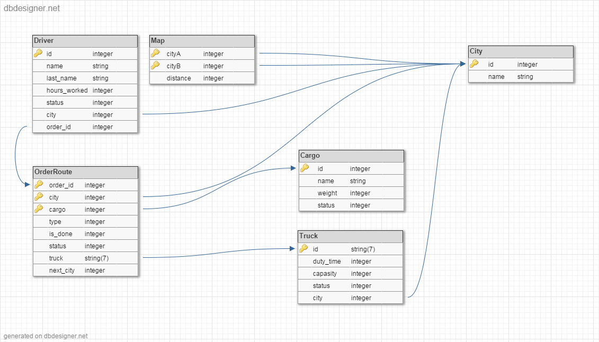

# t-systems java school

# logiweb
logiweb task

The task is to write an application that simulates the work of the information system of a company engaged in the carriage of goods. Below is a more detailed subject area and technical requirements.

DB schema:

## Subject area

The following types of entities:
- Truck
  - Reg. number (2 letters +5 digits)
  - Size driver shift
  - Capacity 
  - Condition (defective, faulty)
- Driver
  - First name
  - Last name
  - Personal number
  - Hours of operation this month
  - Status (rest, work, driving)
  - Current truck
- Order
  - Unique number
  - Completed (yes / no)
  - List of baggage
  - Truck appointed to carry out the order
  - The list of drivers who carry out the order
- Baggage
  - Unique number
  - Name
  - Weight (kg)
  - Status (prepared, shipped, delivered)
- Map
  - Cities
  - Distances

## The application must provide the following functionality:
- For the employees of the company (through UI-interface):
  - View the list, add, edit and delete trucks, drivers;
  - View the list and adding new orders;
  - View the status of orders and freight;
  - Displays a list of trucks that are suitable for delivery of the order if:
    - Truck is in good condition;
    - Truck is suitable for capacity;
    - Truck does not perform at the moment no orders;
  - Selection and appointment of the drivers on the basis of the size of the change and used trucks:
    - Time limit per month (176 hours) for each of the drivers in the change
    - Now the driver does not perform other orders;

 
- For drivers (via UI-interface):
  - Obtain data on their appointments, providing your personal number:
  - Personal number of the driver
  - Personal numbers to drivers
  - Truck number
  - Order number
  - List of baggage

- For drivers (via ws / rs-interface), the actual recorded time:
  - Driver atonement replaced:
    - Personal number of the driver;
    - Status (the main driver, and leisure);
  - Driver has changed status:
    - Personal number of the driver;
    - Status (the main driver, and leisure);
  - Driver finished the shift;
    - Personal number of the driver;
  - Status of the order has changed:
    - Number of baggage;
    - Status (shipped, delivered).

## Technical requirements
As a result, required a multi-user application with the client for the company's employees, the remote server (network connection) and open (on the server) WS/RS systems, interfaces to third-party driver systems. All data stored on the server side. 
Each client may download some data, after each change, the data must be synchronized with the server. The client must have a graphical user interface (console interface is allowed but not recommended). For WS / RS additional client interface is required. It should be possible to call services via REST interface. The application must handle the hardware and software errors.

### Technologies to be used:
1 part:  
- DE - Intellij IDEA
- mcat 8.0.x
- Servlet/JSP
- DB – MySQL 5.6
- Maven 3.*
- JPA 2.0 (Hibernate)

2 part (including previous):  
- AS – Glassfish 4.0
- JAX-WS/RS (Jersey)
- JSF 2.x 
- Spring Framework